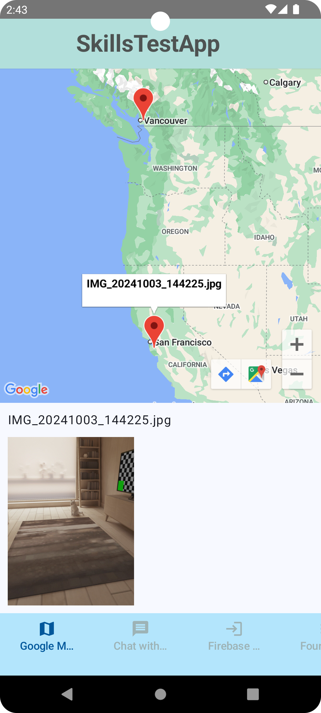
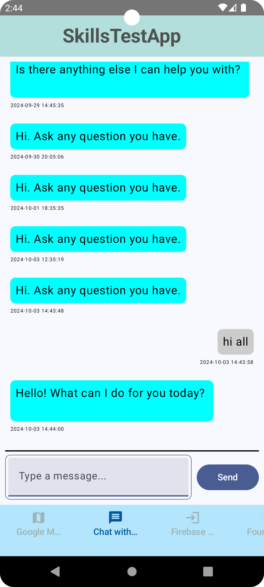
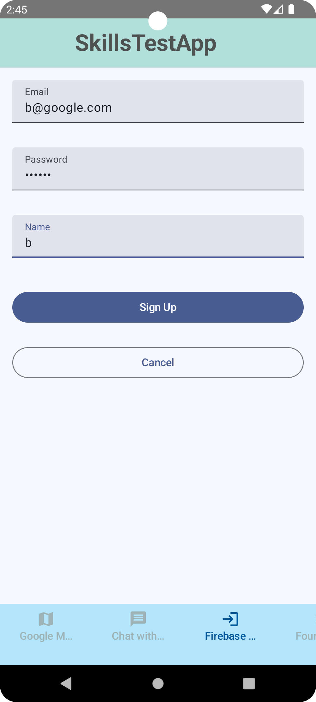
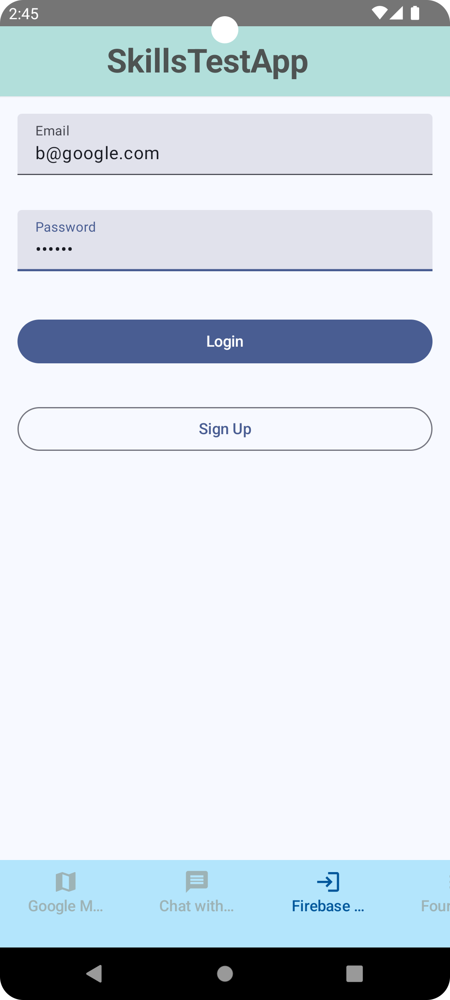
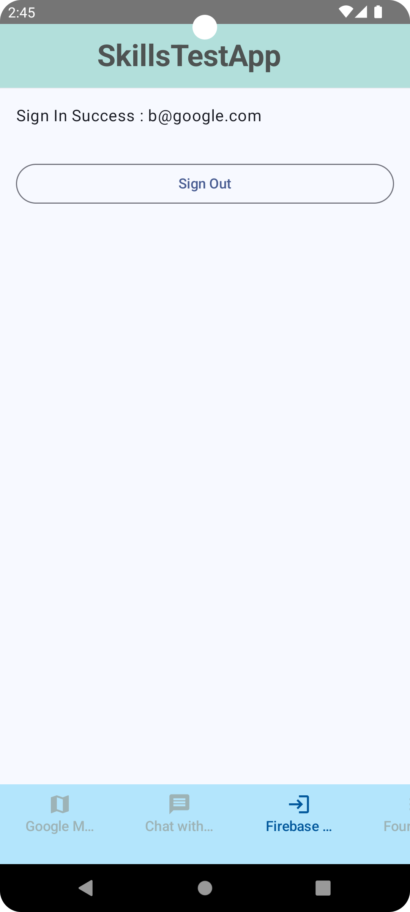
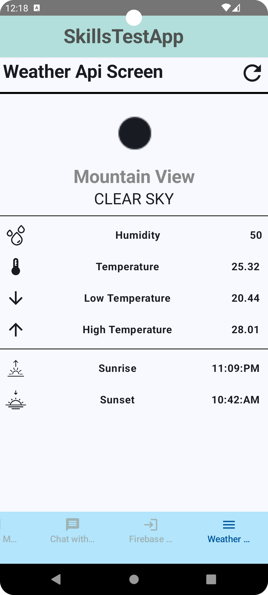

# SkillsTestApp Application
## Important Notice
- This app is still being implemented.
- This app requires the following API KEY list.

  - GoogleMap
  - Gemini AI

## Introduce app
This app contains sample codes that implement various useful functions and libraries that can be used in Android apps.

## Screenshots
#### Google Map

#### Gemini AI Chat

#### Firebase Auth / Register user info

#### Open Weather API test

## Purpose
- Created an app with the purpose of to implement various useful functions and libraries that can be used in Android apps.
- Created an app with latest code and library based on Jetpack Compose 

## Specific SDK / Library / function list
- Jetpack Compose
- Dagger-Hilt
- Kotlin Coroutines
- MVVM architecture
- useful feature and libraries (GoogleMap, Gemini AI, Room database, Coil...)
